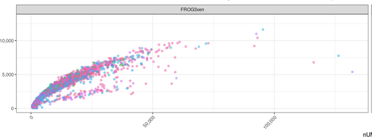
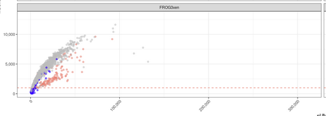
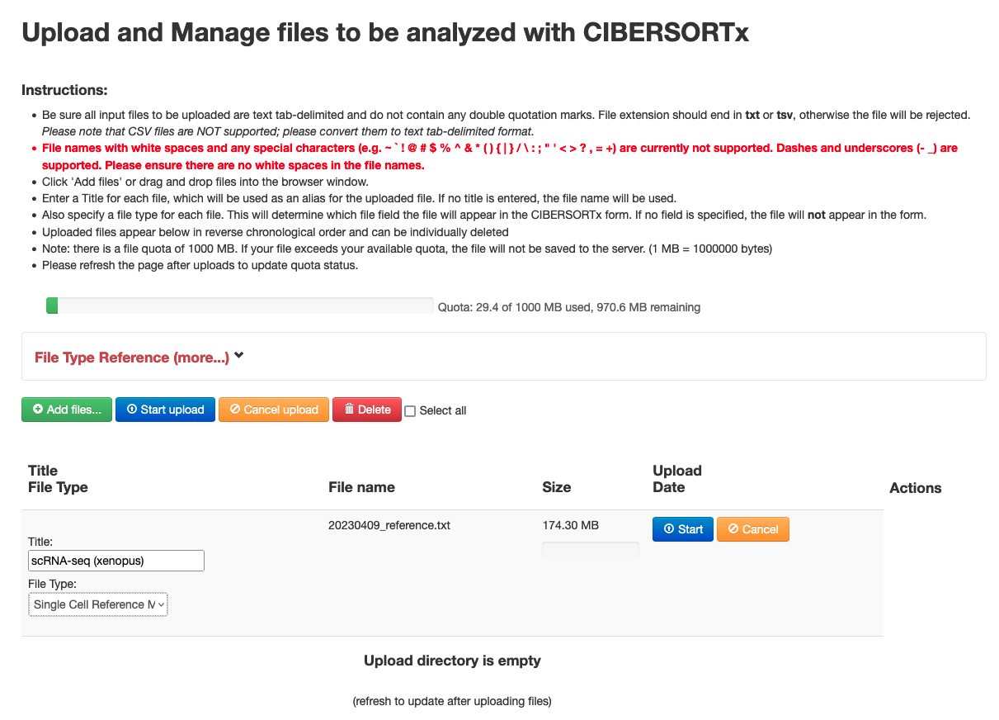
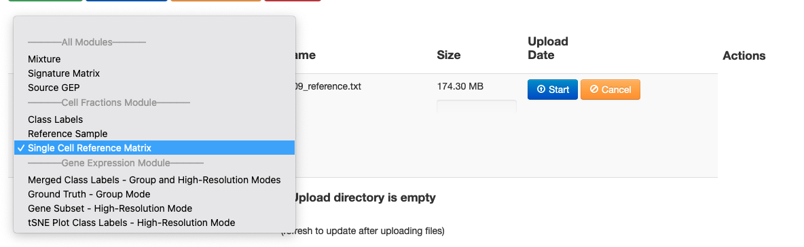
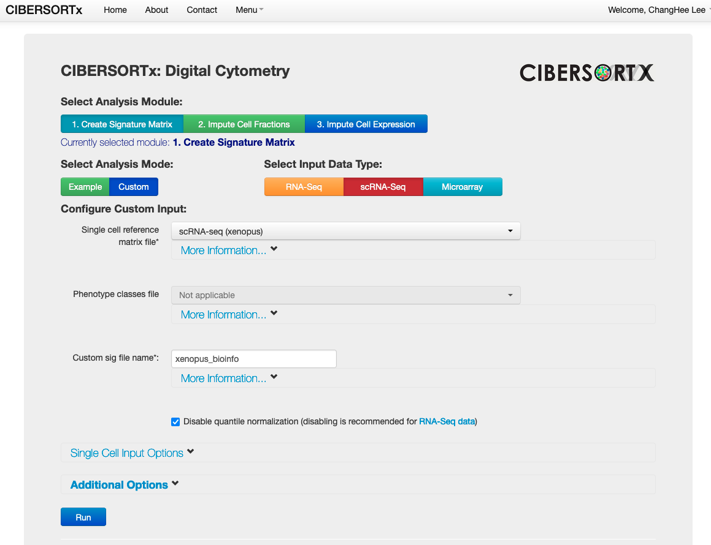
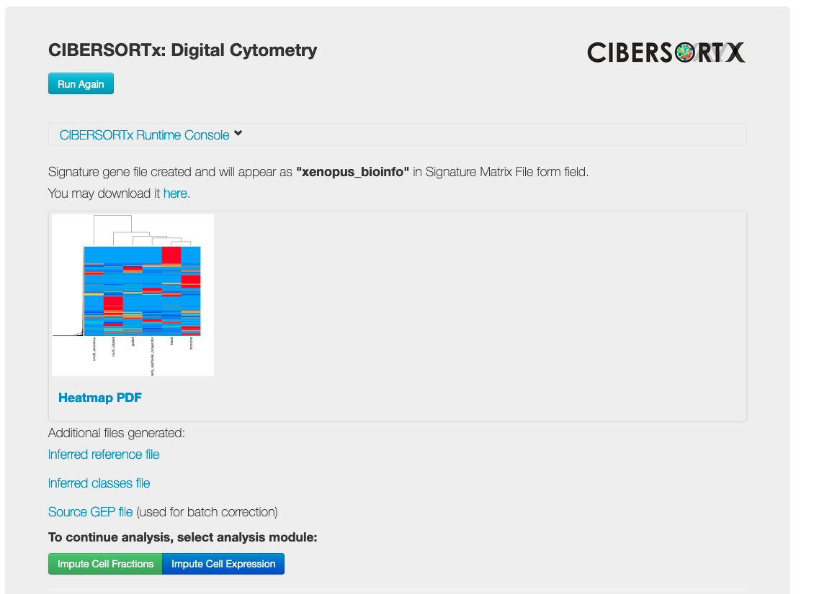
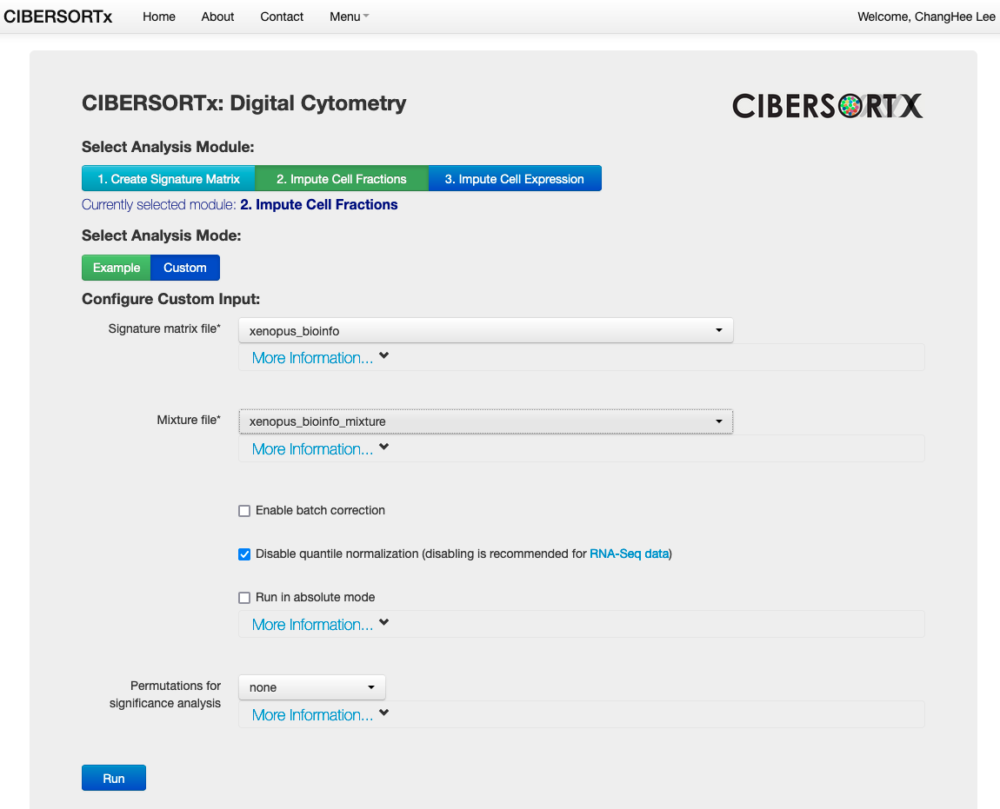
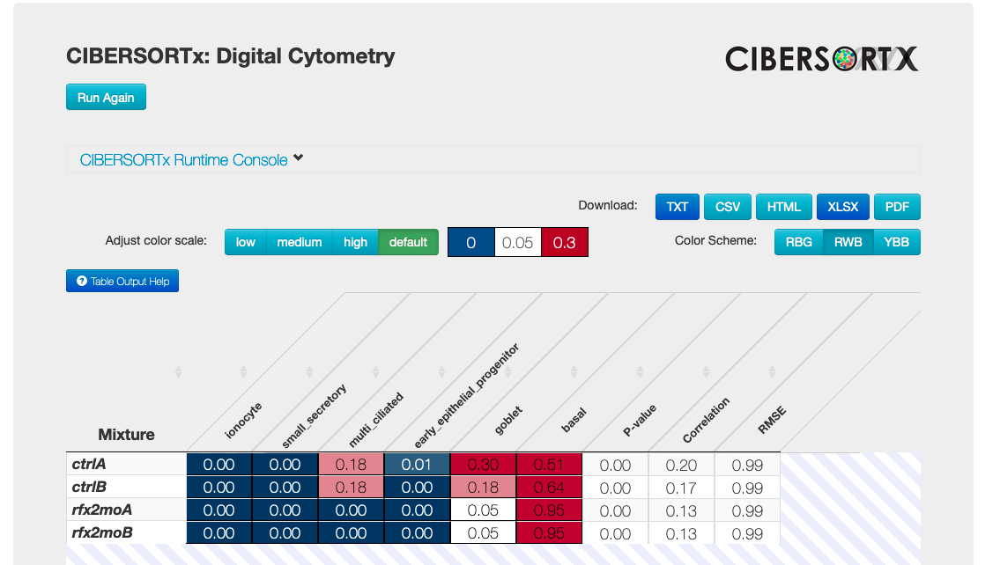

# Objectives & Background

This is a RMarkdown document that will be used for the 20230409 morning sessions to go through together. Some of the objectives are:

* Practical understanding of setting up a clean RStudio environment
* Getting the habit of documenting necessary information in RMarkdown
* KnitR to generate documents.
* Inspecting the count matrices generated from `cellranger`
* Extracing gene-level meta information
* Working through Seurat standard clustering pipeline
  - Quality & Control
  - 

# RStudio Preparations

We assume that you have installed the latest R on your laptop (currently R 4.2.3), and also updated to the latest RStudio (in my case it is 2023.03.0+386 (2023.03.0+386)).

The following code ensures that the packages that I am installing are placed on a defined directory

```{r}
.libPaths("~/R_xenopus")
.libPaths()
```

The following code installs [Bioconductor](https://www.bioconductor.org/install/) package manager. `eval=FALSE` ensures that it does not run two times during RMarkdown generation.

```{r eval=FALSE}
if (!require("BiocManager", quietly = TRUE))
    install.packages("BiocManager")
BiocManager::install(version = "3.16")
```

Now let us install `Seurat`, but one of the strength of R comes from sets of packages developed by the `RStudio` group: `tidyverse`, so let's install this as well (you may have it installed already). And I want to add one more small package `tictoc` that is handy in measuring how long it took to run a patch of code.

During this installation run, which will take few minutes, it asks whether `igraph` package should be compiled in the system. At least in Mac OSX (on 2023-04-07), this fails, so  so do not compile `igraph` but just use the older pre-compiled version instead.
 
```{r eval=FALSE}
BiocManager::install(c("tidyverse", "Seurat", "tictoc", "devtools") )
# See this: https://github.com/Toniiiio/imageclipr
# devtools::install_github('Timag/imageclipr')
```

The following code ensures that the packages are all up-to-date. Note that `igraph` package is out of date, but this is OK, leave it.

```{r}
BiocManager::valid()
```

The above `BiocManager::valid()` run already ran `sessionInfo()` but for all R runs, please include this for reproducibility purposes. This lists all the R packages installed in the system (as directed by `.libPaths()`) with all the versions, so you can track for any issues of reproducibility here.

```{r}
sessionInfo()
```

Double check where you are. This gives you a sense when you want to use relative URLs later:
```{r}
getwd() # Usually the Document directory
here::here() # Usually the project directory
```

(It should be the project folder on your top right corner of RStudio)


# Load libraries and other document-wide parameters

First you load the libraries. These commands will let you use their open functions without invoking the package names. Also it might be useful to set up a project prefix, such that all the intermediate files can be tracked more efficiently.

```{r}
library(tidyverse) # we mostly use dplyr library
library(Seurat)
library(patchwork)

theme_set( theme_bw() )

root.dir <- here::here()

"%ni%" <- Negate("%in%")
project.prefix <- "20230409_"

sessionInfo()
```

If you want to use a specific function from a package you did NOT load by `library` command, you can always use `[library name]::[function name]` which I am going to do in a minute with `tictoc` library:

```{r}
tictoc::tic() # this is a function from the tictoc package
tictoc::toc() # this is a function from the tictoc package
```

Why is it (sometimes) important? Sometimes, if you load too many libraries, depending on the **order**, some functions from different packages with identical names can be overridden, and you create an ambiguity what function to use, so it might be necessary to specify where the function is coming from.

# Load toolkit

Konrad has very useful functions that you can also load. Notice after running this code chunk the changes in environment (typically top right panel):

```{r}
# Not necessary for the practice, but useful
source("https://raw.githubusercontent.com/xenbase-hub/workshop/main/toolbox.R")
```


# Load 10X count data to Seurat

## Load original data and perform inspection

Now let's read a 10X `cellranger` generated count matrix. `Seurat` has a handy function called `Read10X` to load the data into a sparse matrix format (`dgCMatrix`). In the class, we will check where these data are coming from, but it suffices to provide the directory where the necessary files are present:

```{r}
tictoc::tic()
xenopus.data <- Read10X(data.dir = "./scCapSt27_count/outs/filtered_gene_bc_matrices/XENLA_GCA001663975v1_XBv9p2/")
# xenopus.data <- Read10X(data.dir = "./scCapSt27_xen10_1_20230408/outs/filtered_feature_bc_matrix/")

tictoc::toc()
```

```{r}
class(xenopus.data)
head(xenopus.data[,1:30]) # only the first 30 cellular barcodes
```

For this matrix, the rows represent genes(features), and the columns represent cellular barcodes. You can have a peek of how the cell names are represented:

```{r}
head( colnames(xenopus.data) )

nchar("AAACCTGAGCTATGCT-1")
```

This is typical output from `cellranger` where 16bp barcode sequence is suffixed with `-1`.

Now let's make a `SeuratObject` that is used in Seurat package. With some parameters, you can already do some filtering steps here.

```{r}
xenopus <- CreateSeuratObject( 
  counts = xenopus.data,  # Here you put your count matrix
  project = "XenopusBioInfo2023",   # This is just a handy name attached to the object
  min.cells = 3,  # At least 3 cells should have a particular gene expressed
  min.features = 200 # At least a cell should have 200 genes detected to be included
)
```

It is often helpful to pay attention to the warning signs that arise. Here you have two warning messages. Let's check what it means.

First, "Feature names cannot have underscores". Are there genes that have underscores?

```{r}
# This is a common UNIX command that is appropriated to R
grep("_", rownames(xenopus.data), value = T)
```

Yes, there are four gene names that contain a underscore. `hes5` sounds familiar, want to check whether there were any issues with this gene:

```{r}
grep("hes5", rownames(xenopus.data), value = T)
```
As you can see, there are 7 different feature names associated with `hes5`, more than the usual L and S forms. It might be helpful to go back and see whether they represent something in the JBrowser.


Let's check the feature/gene names in the original count matrix loaded:

```{r}
rownames(xenopus.data) %>% head()
```

As you can see, the `cellranger` generated gene names have a format that contains "|". How many are there?

```{r}
grep("|", rownames(xenopus.data), value = T) %>% length()
nrow(xenopus.data)
```

So the entire genes are named with this format, so with a warning, importing this count matrix to Seurat object the `CreateSeuratObject` function did the following:

```{r}
grep("hes5", rownames(xenopus), value = T)
```

There are two things here - one that that `gene134|hes5_X2.L` characters of "_" and "|" are all replaced to "-". 

Quiz: Where are the other 6 `hes5` genes that were found in the original sparse count matrix?

You can answer this here (by changing the Markdown file).


We can also check the changes of cell numbers here during the import:

```{r}
ncol(xenopus.data)
ncol(xenopus)
```

For most of the standard workflows of scRNA-seq analysis, you are interested in a category of genes that are together. One important category that is almost always presented in tutorials are the mitochondrial genes. They are special in that their RNA source is in a different subcellular compartment. Dying cells tend to have more enriched fraction of these mitochondrial genes to other nuclear genes. Do you have genes in this count matrix?

Let's guess (which many tutorials do) whether a usual name is present in the gene list:

```{r}
grep("cytb", rownames(xenopus.data), value = T)

grep("CYTB", rownames(xenopus.data), value = T)
```

The best way would be to go back to the reference annotation you used to build the STAR index that cell ranger used to generate the count matrix.

Quiz: Can you identify the meta information that you can retrieve from the GEO to check whether mitochondrial chromosome is present and identify the mitochondrial gene names?

Below are some potential way to extract quickly the present chromosomal information as well as the gene names when given a GTF file (here the GTF file is from our most up-to-date Xenla10.1)

```{bash eval=F}
# Example code in console. You could potentially use chunk header bash instead of r to run this also in the document.

# For linux
# zcat XENLA_ncbi101.XB2023_04.gtf.gz | gawk '{ print $1 }' | uniq
# For Mac OSX
# gzcat XENLA_ncbi101.XB2023_04.gtf.gz | gawk '{ print $1 }' | uniq
# gzcat XENLA_ncbi101.XB2023_04.gtf.gz | gawk '( $1 == "chrM" )'
gzcat XENLA_ncbi101.XB2023_04.gtf.gz | gawk '{ print $1 }' | uniq
```


```{r}
grep("44447", rownames(xenopus.data), value = T)
```

## Load count matrix from the most up-to-date reference

As I presented yesterday, I have retrieved the archived SRA.lite files and generated FASTQ files to run `cellranger (6.0.1)` again to generate count matrices with the reference that contains mitochondrial genes.

Because of the version difference of `cellranger` to generate the count matrices is different from the original ones (Quiz: what version is it?), you have a slightly different directory structure for loading. Let's re-do all the steps we did in preparation for the standard workflow

One side comment:

It is generally not recommended to re-use (override) same variable names for the reproducibility's sake - one practice is to clean up this RMarkdown file for a final version which does not make the detour of loading the original count matrix, or make more explicit rules to track the variable names associated for a particular dataset. Here, for the sake of being explicit, we will clean up the previous variables and override.

```{r}
rm(xenopus.data)
rm(xenopus)

tictoc::tic()
xenopus.data <- Read10X(data.dir = "./scCapSt27_xen10_1_20230408/outs/filtered_feature_bc_matrix/")
tictoc::toc()
```

```{r}
xenopus <- CreateSeuratObject( 
  counts = xenopus.data,  # Here you put your count matrix
  project = "XenopusBioInfo2023",   # This is just a handy name attached to the object
  min.cells = 3,  # At least 3 cells should have a particular gene expressed
  min.features = 200 # At least a cell should have 200 genes detected to be included
)
```

So again, worthwhile to dig in a bit:

```{r}
# This is a common UNIX command that is appropriated to R
grep("_", rownames(xenopus.data), value = T)
```

Bunch of tRNAs. Please don't stop here when the list is cut-off. Let's check whether tRNA annotations are the only issues here:

```{r}
setdiff(
  grep("_", rownames(xenopus.data), value = T),
  grep("^trna", rownames(xenopus.data), value = T)
)

```
There are some unassigned genes, but then there is one particular gene `ccdc50.L`...

```{r}
grep("ccdc50", rownames(xenopus.data), value = T)
```

```{r}
grep("ccdc50", rownames(xenopus), value = T)
```


Check whether `ccdc50.L` is an important gene, or whether `ccdc50.L_1` is a real separate gene in Xenbase as you learned on Friday.

# Extracting Gene-level meta information

## Mitochondrial genes

We have checked that the up-to-date assembly contains the mitochondrial genome, and their mitochondrial genes are annotated (see previous section). The following is to trim down further to check out mRNAs that are poly adenylated.

```{bash}
gzcat XENLA_ncbi101.XB2023_04.gtf.gz | gawk '( $1 == "chrM" && $3 == "transcript"  )' | grep -v tRNA
```

There are ways to extract the set of gene names that are mitochondrial. One simple way is to manually type them:

```{r}
mito.genes <- c("ND1", "ND2", "COX1", "COX2", "ATP8", "ATP6", "COX3", "ND3", "ND4L", "ND4", "ND5", "ND6", "CYTB")

mito.genes
```

```{r}
rownames(xenopus)[rownames(xenopus) %in% mito.genes]
```


The other way is parsing them by code (which I will leave as a advanced Quiz, but we will come back in extracting ribosomal genes).

In any case, **when you are compiling an information that is not computed, save it as a text table for your record**.

```{r}
save_table(
  mito.genes, 
  glue::glue("{project.prefix}mito_genes"),
  format="csv"
)
```

We can now set up the mitochondrial gene fraction.

```{r}
xenopus[["percent.mt"]] <- Seurat::PercentageFeatureSet( xenopus, features = mito.genes )

xenopus@meta.data
```


## Ribosomal genes

For ribosomal genes, I have compiled the list from the [UniProt database](https://www.uniprot.org/uniprotkb?query=%22ribosomal%20protein%22%20AND%20(taxonomy_id:8355)). Download the files.

```{r}
read_tsv("uniprot-download_true_fields_accession_2Creviewed_2Cid_2Cprotein_nam-2023.02.20-13.44.52.34.tsv") %>% head()

read_tsv("uniprot-download_true_fields_accession_2Creviewed_2Cid_2Cprotein_nam-2023.02.20-13.44.52.34.tsv") %>% 
dplyr::count( `Reviewed` )
```
```{r}
# this takes out a lot o
provisional  <-
bind_rows(
    read_tsv("uniprot-download_true_fields_accession_2Creviewed_2Cid_2Cprotein_nam-2023.02.20-13.44.52.34.tsv", show_col_types = F),
) %>%
dplyr::select(`Gene Names`, `Organism` ) %>%
dplyr::filter( !is.na(`Gene Names`) ) %>%
separate_rows( `Gene Names`, convert = FALSE, sep = " " ) %>%
pull(`Gene Names` )
#dplyr::filter( grepl("14e22", `Gene Names` ) )

provisional
```

```{r}
provisional %>% length()

```

```{r}
intersect( rownames(xenopus), provisional ) %>% length()
# intersect( gene.list.frog, provisional )
```

```{r}
# Potential genes that might be missed
potential <- setdiff( provisional, rownames(xenopus) )
potential
```

```{r}
provisional2 <- intersect( c( paste0( potential, ".L" ), paste0( potential, ".S" )), rownames(xenopus))

provisional2
```

```{r}
potential2 <- setdiff( provisional, provisional2 )
potential2
```


```{r}

grep("rpl", rownames(xenopus), value = T) %>% sort()
```

```{r}
ribo.genes <- intersect( rownames(xenopus), c(provisional, provisional2) )
ribo.genes
ribo.genes %>% length()
```


```{r}
xenopus[["percent.ribo"]] <- Seurat::PercentageFeatureSet( xenopus, features = ribo.genes )

```

```{r}
xenopus@meta.data
```


## Hemoglobin genes

Depending on the situation it is helpful to have hemoglobin genes to recognize a particular cell types, the red blood cells. There is a typical convention of naming them, I have followed this to put manually, but make sure they are correct

```{r}
rbc.genes <- 
setdiff( 
    grep("^hb", rownames(xenopus), value = T),
    grep("^hb(egf|ox)", rownames(xenopus), value = T)
)

rbc.genes
```

```{r}
xenopus[["percent.rbc"]] <- Seurat::PercentageFeatureSet( xenopus, features = rbc.genes )

```


With these three additions, you have essentially meta information for each cells that you can check out in the Seurat object `@meta.data` slot:

```{r}
xenopus@meta.data
```

We can do the visualization:

```{r}
VlnPlot(
  xenopus, 
  features = c(
    "nFeature_RNA", 
    "nCount_RNA", 
    "percent.mt",
    "percent.ribo"
  ), 
  ncol = 4,
  pt.size = 0
)

VlnPlot(
  xenopus,
  features = c(
    "percent.rbc"
  )
)
```
## Cell-cycle genes

In Seurat tutorial, this is quite ad-hoc from one paper to determine the cell cycle genes:

```{r}
data('cc.genes')

gene.list.frog  <- rownames(xenopus)

# cc.genes$s.genes   <- map( cc.genes$s.genes, simpleCap )
# cc.genes$g2m.genes <- map( cc.genes$g2m.genes, simpleCap )

# setdiff( tolower(cc.genes$s.genes), gene.list.frog ) # Mlf1ip is Cenpu

tolower(cc.genes$s.genes) %>% sort()
grep( 
    paste0( "^(", paste( tolower(cc.genes$s.genes), collapse = "|" ), ")" ),
    gene.list.frog,
    value = T
) %>% sort()

map_dfr(
    cc.genes$s.genes,
    function(g) {
        tibble(
            gene = tolower(g),
            match = paste( grep( paste0( "^", tolower(g), "\\." ), gene.list.frog, value = T), collapse = "," )
        )
    }
)

map_dfr(
    cc.genes$g2m.genes,
    function(g) {
        tibble(
            gene = tolower(g),
            match = paste( grep( paste0( "^", tolower(g), "\\." ), gene.list.frog, value = T), collapse = "," )
        )
    }
)


```
```{r}
# Two genes are not found
# casp8ap2
# mlf1ip - cenpu

grep("cenpu", gene.list.frog, value = T)
# grep("ced-", gene.list.frog, value = T)  # https://www.xenbase.org/entry/gene/showgene.do?method=displayGeneSummary&geneId=XB-GENE-6257801

# fam64a
# ckap2l
# hjurp
# hn1
# cdca2
# psrc1

grep("pimreg", gene.list.frog, value = T) # fam64a
grep("ckap2", gene.list.frog, value = T) # ckap2l https://www.xenbase.org/entry/gene/showgene.do?method=displayGeneSummary&geneId=XB-GENE-13579809 not present?
grep("jpt1", gene.list.frog, value = T) # hn1
grep("22068216", gene.list.frog, value = T) # https://www.xenbase.org/entry/gene/showgene.do?method=displayGeneSummary&geneId=XB-GENE-22068215

```
```{r}
cc.genes.frog <- cc.genes
cc.genes.frog$s.genes <- c(
    grep( 
        paste0( "^(", paste( tolower(cc.genes$s.genes), collapse = "|" ), ")\\." ),
        gene.list.frog,
        value = T
    ),
    "cenpu.L"
)

cc.genes.frog$g2m.genes <- c(
    grep( 
        paste0( "^(", paste( tolower(cc.genes$g2m.genes), collapse = "|" ), ")\\." ),
        gene.list.frog,
        value = T
    ),
    "pimreg.L",
    "jpt1.L",
    "jpt1.S"
)

cc.genes.frog
```

Try out below:

```{r}
# DefaultAssay(xenopus) <- "RNA"
# 
# xenopus <-
# CellCycleScoring(
#   xenopus,
#   s.features = unlist(cc.genes.frog$s.genes),
#   g2m.features = unlist(cc.genes.frog$g2m.genes),
#   set.ident = F
# )
# 
# xenopus@meta.data
```


Why is the error happening?


# Investigating meta information (cell characteristics)

## UMI to Gene relationship

```{r}
xenopus@meta.data %>%
  dplyr::slice(sample(1:n()))  %>%  # just to avoid any artificial "clumping" because of the library
  ggplot( aes(x = nCount_RNA, y = nFeature_RNA)) +
#  ggplot( aes(x = nUMI, y = nGene, colour=percent.mito)) +
  geom_point( alpha = 0.5 ) + 
  geom_smooth() +
  # geom_hline( yintercept = 500, linetype = "dashed", colour="salmon" ) +
  # geom_hline( yintercept = 300, linetype = "dashed", colour="blue" ) +
  scale_x_continuous( 
    labels = scales::comma 
  ) +
  scale_y_continuous(labels = scales::comma) +
#  facet_wrap( library ~ . , scale = "free_x") +
  # scale_color_hue(name = "mitochondrial content", 
  #                 labels = c(">25%", "<=25%")) +
  theme(axis.text.x = element_text(angle = 45, hjust = 1))
```

This looks OK, with some large cells (in terms of RNA content) spread out. around UMI=2500 threshold..

There can be also cells that have lower gene content than the rest, not in this dataset, but showing one example here:



```{r}
xenopus@meta.data %>%
  mutate(
    call = case_when(
      percent.mt > 20 ~ "mito > 20%",
      percent.rbc > 1 ~ "rbc > 1%",
      TRUE ~ "pass"
    )
  ) %>%
  dplyr::slice(sample(1:n())) %>%   # just to avoid any artificial "clumping" because of the library
  ggplot( aes(x = nCount_RNA, y = nFeature_RNA, colour=call)) +
#  ggplot( aes(x = nUMI, y = nGene, colour=percent.mito)) +
  geom_point( alpha = 0.5 ) + 
  geom_hline( yintercept = 1000, linetype = "dashed", colour="salmon" ) +
  scale_x_continuous( 
    labels = scales::comma 
  ) +
  scale_y_continuous(labels = scales::comma) +
  scale_color_manual(
    name = "outliers",
    values = c(
      "mito > 20%" = "blue",
      "rbc > 1%" = "salmon",
      "pass" =  "grey"
    )
  ) +
  ggtitle(
    "Stable relationship between nUMI and nGene"
  ) +
  theme(axis.text.x = element_text(angle = 45, hjust = 1))
```

Again, the same different example showing cases where RBC contamination is strong.


## Mitochondrial content

```{r}
xenopus@meta.data %>%
  dplyr::slice(sample(1:n())) %>%   # just to avoid any artificial "clumping" because of the library
  mutate(
    state = case_when(
      percent.mt > 20 ~ "mito(20%+)",
      percent.mt > 5 ~ "mito(5%+)",
      percent.rbc  > 1 ~ "rbc(1%+)",
      TRUE ~ "pass"
    )
  ) %>%
  ggplot( aes(x = nFeature_RNA, y = percent.mt, colour=state)) +
  geom_point( alpha = 0.5 ) + 
  geom_hline( yintercept = 1, linetype = "dashed", colour="salmon" ) + 
  geom_hline( yintercept = 5, linetype = "dashed", colour="salmon" ) + 
  geom_hline( yintercept = 20, linetype = "dashed", colour="navy" ) + 
  geom_vline( xintercept = 1000, linetype = "dashed", colour="blue" ) +
  geom_vline( xintercept = 2500, linetype = "dashed", colour="salmon" ) +
  scale_x_continuous( 
    breaks = c(0, 1000, 2000, 4000, 6000, 8000, 10000, 20000, 30000), 
    labels = scales::comma 
  ) +
  scale_color_manual(
      name = "outliers",
      values = c(
          "mito(20%+)" = "navy", 
          "mito(5%+)" = "green",
          "pass" = "grey", 
          "rbc(1%+)" = "salmon"
      )
  ) +
  ggtitle("Exploration of potential dead cells",
          paste0(
            "Clear inverse relationship between # of genes and mito content,\n",
            "for low nGene small cells"
          )
  ) +
  theme(axis.text.x = element_text(angle = 45, hjust = 1))
```
## Ribosmal content

```{r}
colnames( xenopus@meta.data )
```


```{r}
xenopus@meta.data %>%
  dplyr::filter( percent.mt < 20 ) %>%
  ggplot( aes( x = orig.ident, y = percent.ribo ) ) +
  geom_violin( scale="width", trim = TRUE )
```
```{r}
xenopus@meta.data %>%
  ggplot( aes( x = percent.mt, y = percent.ribo ) ) +
  geom_point( alpha = 0.2 ) +
  # theme(
  #   axis.text.x = element_text( angle = 45, hjust = 1 )
  # ) +
#  coord_flip() +
  ggtitle("Relationship between ribosomal and mitochondrial content")
```


# Standard Pre-processing workflow

## Normalization

```{r}
xenopus <- NormalizeData( 
  xenopus,
  normalization.method = "LogNormalize",
  scale.factor = 10000
)
```
## Identification of highly variable features (feature selection)

```{r}
xenopus <- FindVariableFeatures(
  xenopus,
  selection.method = "vst",
  nfeatures = 2000
)
```

```{r}
# Identify the 10 most highly variable genes
top10 <- head(VariableFeatures(xenopus), 10)
top10

```


```{r}

# plot variable features with and without labels
plot1 <- VariableFeaturePlot(xenopus)
plot2 <- LabelPoints(plot = plot1, points = top10, repel = TRUE)
plot1 + plot2
```

```{r}
top10
```

## Scaling the data

Next, we apply a linear transformation (‘scaling’) that is a standard pre-processing step prior to dimensional reduction techniques like PCA. The ScaleData() function:

* Shifts the expression of each gene, so that the mean expression across cells is 0
* Scales the expression of each gene, so that the variance across cells is 1
** This step gives equal weight in downstream analyses, so that highly-expressed genes do not dominate
* The results of this are stored in `xenopus[["RNA"]]@scale.data`

```{r}
# Conduct scaling to everything
tictoc::tic()
xenopus <- ScaleData(
  xenopus, 
  features = rownames(xenopus),
  vars.to.regress = "percent.mt"
)
tictoc::toc()
```

## Perform linear dimensional reduction (principal component)

```{r}
tictoc::tic()
xenopus <- RunPCA(xenopus, features = VariableFeatures(object = xenopus))
tictoc::toc()
```

```{r}
# Examine and visualize PCA results a few different ways
print(xenopus[["pca"]], dims = 1:5, nfeatures = 5)
```
```{r}
VizDimLoadings(xenopus, dims = 1:2, reduction = "pca")
```
```{r}
ElbowPlot(xenopus)
```


```{r}
xenopus <- FindNeighbors(xenopus, dims = 1:5)
xenopus <- FindClusters(xenopus, resolution = 0.1)
```
```{r}
# If you haven't installed UMAP, you can do so via reticulate::py_install(packages =
# 'umap-learn')
xenopus <- RunUMAP(xenopus, dims = 1:5)
```

```{r}
DimPlot(xenopus, reduction = "umap")
```

```{r}
xenopus@meta.data
```

```{r eval=F}
# install fast differential gene expression
devtools::install_github("immunogenomics/presto")
```
## Quick survey and annotation based on differentially expressed marker expression

```{r}
DefaultAssay( xenopus ) <- "RNA"

presto::wilcoxauc( xenopus, 'RNA_snn_res.0.1' ) %>%
group_by( group ) %>%
arrange( group, pct_out - pct_in) %>%
#filter( row_number() <= 5 ) %>%
dplyr::filter( group == 2 )
```

```{r}
presto::wilcoxauc( xenopus, 'RNA_snn_res.0.1' ) %>%
  dplyr::filter( grepl("txn.L", feature)) # ionocyte = cluster == 1
```


```{r}
presto::wilcoxauc( xenopus, 'RNA_snn_res.0.1' ) %>%
  dplyr::arrange( desc(auc) ) %>%
  dplyr::filter( grepl("foxa1", feature)) # small secretory cell = cluster == 2
```


```{r}
presto::wilcoxauc( xenopus, 'RNA_snn_res.0.1' ) %>%
  dplyr::filter( feature == "itln1.L") # goblet cells = cluster == 3
```


```{r}
presto::wilcoxauc( xenopus, 'RNA_snn_res.0.1' ) %>%
  dplyr::filter( grepl("tekt2.S", feature)) # multi ciliated cell = cluster == 4

```


```{r}
presto::wilcoxauc( xenopus, 'RNA_snn_res.0.1' ) %>%
  dplyr::filter( grepl("gpx3.S", feature)) # basal = cluster == 5

```

Traditional way of finding marker genes (as an example):

```{r}
# find all markers of cluster 2
cluster5.markers <- FindMarkers(xenopus, ident.1 = 5, min.pct = 0.25)
head(cluster5.markers, n = 5)
```

The below is a boiler plate to check the expression pattern

```{r}
FeaturePlot(
  xenopus,
  features = c("gpx3.S", "prmt1.S"),
  order = T
)
```
```{r}
# new.cluster.ids <- c(
#   1 = "ionocyte",
#   2 = "small secretory",
#   3 = "goblet",
#   4 = "multi-ciliated",
#   5 = "basal"
# )

xenopus$annotation <- case_when(
  xenopus$RNA_snn_res.0.1 == 1 ~ "ionocyte",
  xenopus$RNA_snn_res.0.1 == 2 ~ "small_secretory",
  xenopus$RNA_snn_res.0.1 == 3 ~ "goblet",
  xenopus$RNA_snn_res.0.1 == 4 ~ "multi_ciliated",
  xenopus$RNA_snn_res.0.1 == 5 ~ "basal",
  xenopus$RNA_snn_res.0.1 == 0 ~ "early_epithelial_progenitor",
  TRUE ~ "ambiguous"
)

DimPlot(
  xenopus,
  group.by = "annotation",
  label = T
) +
  theme( legend.position = "bottom" )

```
```{r}
grep("dll", rownames(xenopus), value = T)
```

```{r}
FeaturePlot(
  xenopus,
  features = c(
#    "htr3a.L", # serotonin receptor
    "notch2.L",
    "notch2.S",
    "notch1.L",
    "notch1.S"
  ),
  order = T
)
```
```{r}
FeaturePlot(
  xenopus,
  features = c(
    "dll1.L",
    "dll1.S"
  ),
  order = T
)
```

You save any variable that is important. Explicitly selecting variables that will be kept for future will be helpful rather than saving the current environment as is.

```{r}
tictoc::tic()
saveRDS( xenopus, file=glue::glue("{project.prefix}xenopusobject.rds"))
tictoc::toc()
```

# Deconvolution

```{r}
tictoc::tic()
xenopus <- readRDS( file=glue::glue("{project.prefix}xenopusobject.rds"))
tictoc::toc()
```


## Deconvolution of Bulk RNA-seq data from scRNA-seq (CIBERSORTx)

### Check bulk RNA-seq dataset

Check first what we have for the bulk RNA-seq dataset:

```{r}
cpm <- read_tsv("../ChungKwon2014.XENLA_rfx2mo_exp/Chung2014.cpm_table.tsv")

cpm
```

Need to check whether the gene names are inter-operatable.

```{r}
intersect( rownames(xenopus), cpm$ID ) %>% length()

setdiff( cpm$ID, rownames(xenopus) ) %>% length()
setdiff( rownames(xenopus), cpm$ID ) %>% length()
```

There are 5 genes that are present in the scRNA-seq data based on XenLae10.1 that is NOT present in the CPM data:

```{r}
setdiff( rownames(xenopus), cpm$ID )
```


### Generation reference matrix for CIBERSORTx

Shall we "normalize" the number of references across annotations? This might be necessary if there is very unqual distribution of gene expression.

```{r}
xenopus@meta.data %>%
  dplyr::count( annotation )
```

Except for the early epithelial progenitor annotation, most have comparable number of cells, so will not normalize the reference.

```{r}
# Extract the count matrix from the scRNA-seq
tictoc::tic()
reference <- as.matrix( GetAssayData( xenopus, slot = "counts" ) )
tictoc::toc()
```

```{r}
# Make sure that the reference IDs are aligned
ncol(reference)
nrow(xenopus@meta.data)

all(colnames(reference) == rownames(xenopus@meta.data)) # Assert TRUE!
```


```{r}
colnames(reference) <- xenopus$annotation
```

```{r}
# Only genes of interests
reference <- reference[intersect( rownames(xenopus), cpm$ID ), ]
```

```{r}
tictoc::tic()
ref <- apply( reference, 2, as.character )
tictoc::toc()

head(ref[,1:10])
```

Now that the matrix is converted to character matrix, can add in as the first column the gene matrix.

```{r}
reference_to_export <- cbind( rownames(reference), ref)

# Then change the colnames to include Genesymbol
colnames(reference_to_export) <- c("Genesymbol", colnames(reference))
```


```{r}
tictoc::tic()
write.table( 
  reference_to_export, 
  file=glue::glue("{project.prefix}reference.txt"),
  sep = "\t",
  quote=FALSE,
  row.names = FALSE,  # We have the row names as the first column
  col.names = TRUE
)
tictoc::toc()
```

```{r}
# tictoc::tic()
# write.table(
#   reference, 
#   file=glue::glue("{project.prefix}reference.txt"), 
#   sep = "\t", 
#   quote=FALSE, 
#   row.names = TRUE,
#   col.names = TRUE
# )
# tictoc::toc()
```

Upload the reference file (that has the Genesymbol column) and upload as a single cell reference matrix file.




Then generate the signature matrix.


If it works well, it will generate a heat table, representative matrix.



Then you can conduct the cell fraction inferences:


That will result in estimation of the cell type fractions that you can download.



You can notice that the controls have about 18% of multi-ciliated cells, and some fractions for goblets, but in the morpholino case, these cell populations are gone.


## Deconvolution of organisms

Show the slides.

# Building your own gene sets (Gene Set Enrichment Analysis)

See the Youtube video! (Enrichr)